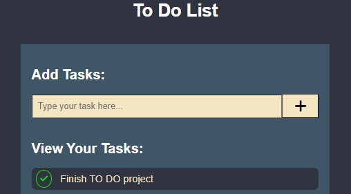

# To Do List

  

Project developed to act as personal To - Do List 
You can do the following:

<ul>
  <li>Add a task</li>
  <li>Check if task is completed</li>
  <li>Remove task</li>
</ul>

To access the project click <a href='https://basic-calculator-plum-xi.vercel.app/'>here</a> 

